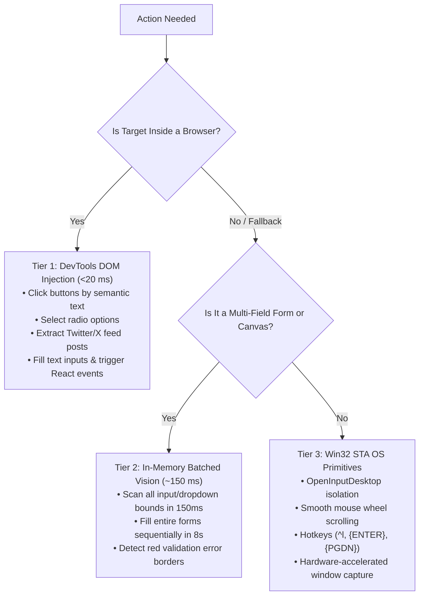

# 🚀 Computer Use Hybrid Automation Skill

The `computer-use` skill provides high-speed browser and desktop automation by replacing the traditional 8–12 second visual perception loop with an adaptive **3-Tier Hybrid Engine**:
- **Tier 1: DevTools DOM Injection (<20 ms)**: Dispatches synthetic React/Vue/Angular events directly into the browser context.
- **Tier 2: In-Memory Fast Batched Vision (~150 ms)**: Detects form fields, dropdowns, and error borders without calling external vision models.
- **Tier 3: Resilient Win32 STA Primitives**: Executes native clicks, scrolls, and key combinations in isolated `OpenInputDesktop` single-threaded apartment threads.

---

## ⚡ Quick Decision Hierarchy: Which Tier to Route To?



---

## 📋 Core Workflows & Runbooks

### Workflow 1: Twitter / X Feed Reading, Summarizing & Interacting

Use this workflow to ingest social feeds, generate structured digests, and interact without visual perception delays:

```python
from computer_use import ComputerUseController

cu = ComputerUseController()

# 1. Navigate to Twitter / X
cu.navigate("https://x.com/home")

# 2. Extract 20 posts with auto-scrolling (<1s total)
posts = cu.extract_twitter_posts(count=20, auto_scroll=True)

# 3. Generate content intelligence summary
summary = cu.summarize_feed(posts)
print(summary["markdown_digest"])

# 4. Like or bookmark a target tweet via sub-20ms synthetic DOM click
cu.interact_twitter_post(query="open-source", action="like")
```

Executable helper available at: [scripts/twitter_digest.py](scripts/twitter_digest.py)

---

### Workflow 2: Ultra-Fast DOM Event Injection (<20ms)

When interacting with modern Single Page Applications (React, Angular, Vue), standard mouse clicks often fail to trigger underlying state change listeners. Use DOM injection to dispatch the full event cycle (`mouseenter` $\to$ `mousedown` $\to$ `mouseup` $\to$ `click` $\to$ `input` $\to$ `change`):

```python
from computer_use import ComputerUseController

cu = ComputerUseController()

# Click button by accessible text
cu.dom.click_button("Deploy Changes")

# Select radio option by surrounding label text
cu.dom.select_radio("High Availability Multi-Region")

# Fill form field by label or placeholder
cu.dom.fill_input("Cluster Name", "prod-us-east-01")
```

---

### Workflow 3: Fast Batched Form Filling & Error Recovery (~150ms)

When automating multi-step forms or desktop software where DOM is unavailable:

```python
from computer_use import ComputerUseController

cu = ComputerUseController()

# 1. Capture screen
screen_path = "form_page.png"
cu.capture(screen_path)

# 2. In-memory detection (<150ms)
boxes = cu.vision.detect_dropdown_boxes(screen_path)

# 3. Batch fill dropdowns sequentially
cu.batch.batch_fill_dropdowns(
    image_path=screen_path,
    field_click_delay_ms=180
)

# 4. Self-healing: automatically detect and fix red validation borders
cu.batch.recover_unfilled_fields("form_check.png")
```

---

### Workflow 4: Zero-Dependency Native PowerShell Automation

No Python environment needed! Import and run the native Windows module:

```powershell
Import-Module .\powershell\ComputerUse.psd1

# Harvest Twitter/X feed
Invoke-CUTwitterExtract -Count 20

# Like target tweet via synthetic DOM dispatch
Invoke-CUTwitterInteract -Query "open-source" -Action "like"

# Fast DOM Click
Invoke-CUDOMClick -ButtonText "Save Configuration"

# Screen Capture & OS Click
Invoke-CUCapture -Path "screen.png"
Invoke-CUClick -X 1280 -Y 850
```

---

## 📚 Detailed Reference Documentation

For in-depth specifications, consult the reference guides in this skill:
- **[API Reference](references/api-reference.md)**: Exhaustive Python and PowerShell signatures, arguments, and return types.
- **[Architecture & Benchmarks](references/architecture.md)**: Latency breakdowns, synthetic event lifecycles, and STA desktop isolation.
