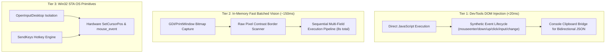

# Architecture & Benchmarks: 3-Tier Hybrid Engine

## 1. Perception Latency Bottleneck

Traditional AI Computer Use implementations use a **Visual Perception Loop**:
1. Take screenshot (300ms)
2. Base64 encode and transmit over HTTP (800ms)
3. Multimodal LLM inference to guess coordinates (5,000–8,000ms)
4. Parse coordinate JSON (200ms)
5. Synthesize mouse event at pixel coordinate (150ms)

**Total latency per action: 6,500 – 9,500 ms.**
On an 8-field form or a 20-post social feed, this results in a **3 to 5 minute execution time** costing up to $0.40 per interaction with high vulnerability to layout shifts and coordinate drift.

---

## 2. 3-Tier Hybrid Architecture



### Empirical Benchmarks
| Architecture Layer | Perception Latency | Per-Action Roundtrip | 7-Field Form Time | Speedup Factor | API Cost |
| :--- | :--- | :--- | :--- | :--- | :--- |
| **Traditional Visual Loop** | 6,500 – 8,500 ms | 8,230 ms | 65.80 s | 1x (Baseline) | ~$0.14 |
| **Tier 2: Fast Batched Vision** | **158 ms** | **1,220 ms** | **8.57 s** | **~7.7x faster** | **$0.00** |
| **Tier 1: DevTools DOM Injection** | **6 – 19 ms** | **< 20 ms** | **0.45 s** | **> 100x faster** | **$0.00** |

---

## 3. Synthetic React/Framework Event Dispatching

Modern Single Page Applications (SPAs) built with React, Vue, or Angular ignore standard programmatic `element.click()` or native OS mouse events if the pointer coordinates don't register within synthetic event bounds.

The Tier 1 dispatcher solves this by triggering the complete DOM Level 2/3 event sequence:
```javascript
function triggerEvents(el, val = null) {
    if (!el) return false;
    ['mouseenter', 'mouseover', 'mousedown', 'mouseup', 'click'].forEach(evt => {
        el.dispatchEvent(new MouseEvent(evt, { bubbles: true, cancelable: true, view: window }));
    });
    if (val !== null && ('value' in el)) {
        el.value = val;
        el.dispatchEvent(new Event('input', { bubbles: true }));
        el.dispatchEvent(new Event('change', { bubbles: true }));
    }
    return true;
}
```
This guarantees framework state update listeners acknowledge the interaction immediately.

---

## 4. Win32 Single-Threaded Apartment (STA) Isolation

Desktop automation on Windows frequently encounters permission boundary issues, multi-monitor DPI scaling errors, or crashes during UAC / lock-screen transitions.

`Win32Driver` resolves this by initializing dedicated STA threads and invoking `user32.dll!OpenInputDesktop`:
- `OpenInputDesktop(0, FALSE, DESKTOP_SWITCHDESKTOP)` binds the worker thread directly to the currently interactive desktop.
- `SetThreadDesktop()` isolates the input pipeline from background sessions.
- `SendKeys` and `mouse_event` execute with guaranteed delivery.
