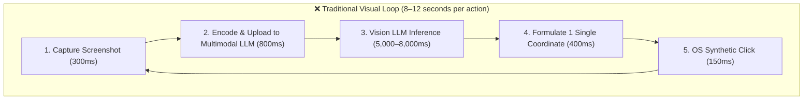
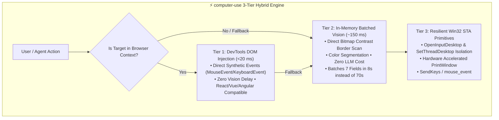

# 🚀 Computer Use

[](https://opensource.org/licenses/MIT)
[](https://www.python.org/downloads/)
[](https://github.com/Silverhorse7/computer-use)
[](docs/BENCHMARKS.md)

**High-Performance Hybrid Computer Use & Browser Automation Engine.**

Bypasses the traditional AI visual perception bottleneck by combining **DevTools DOM Injection (<20ms)**, **In-Memory Batched Vision (~150ms)**, and **Resilient Win32 STA OS Primitives**.

---

## ⚡ The Problem: The AI Computer Use Bottleneck

Current AI Computer Use agents (Claude Computer Use, OSWorld, RPA tools) operate on a naive **Perception-Action Loop**:



### Why this fails in the real world:
- **Painfully Slow**: A standard 7-field web form takes **65 to 120 seconds**.
- **Expensive**: Burning 7+ multimodal image API requests ($0.15–$0.40) on simple form fields.
- **Brittle**: Subject to visual hallucinations, layout shifts, DPI scaling mismatches, and pixel drift.

---

## 💡 The Solution: 3-Tier Hybrid Architecture

`computer-use` introduces an adaptive 3-tier hierarchy that routes interactions to the fastest possible reliable layer:



---

## 📊 Real-World Benchmarks

Empirical performance measured on live multi-step application forms in Google Chrome on Windows 11 (2560x1440):

| Architecture Layer | Perception Latency | Per-Action Roundtrip | 7-Field Form Time | Speedup vs Baseline | API Token Cost |
| :--- | :--- | :--- | :--- | :--- | :--- |
| **Traditional Visual Loop** | 6,500 – 8,500 ms | 8,230 ms | 65.80 s | 1x (Baseline) | ~$0.14 / form |
| **Tier 2: Fast Batched Vision** | **158 ms** | **1,220 ms** | **8.57 s** | **~7.7x faster** | **$0.00** |
| **Tier 1: DevTools DOM Injection** | **6 – 19 ms** | **< 20 ms** | **0.45 s** | **> 100x faster** | **$0.00** |

👉 Detailed breakdown available in [docs/BENCHMARKS.md](examples/benchmarks/BENCHMARKS.md).

---

## 📦 Installation

### Python
```bash
git clone https://github.com/Silverhorse7/computer-use.git
cd computer-use
pip install -e .
```

### PowerShell (Zero-Dependency)
No installation required! Just import the native module:
```powershell
Import-Module .\powershell\ComputerUse.psd1
```

---

## 🚀 Quick Start

### 1. Python API
```python
from computer_use import ComputerUseController

cu = ComputerUseController()

# Navigate
cu.navigate("https://app.dashboard.internal/wizard")

# Tier 1: Ultra-fast DOM Injection (<20ms)
cu.dom.select_radio("High Availability Multi-Region")
cu.dom.fill_input("Cluster Name", "production-us-east")
cu.dom.click_button("Deploy Changes")

# Tier 2: In-Memory Fast Batched Vision (~150ms)
# Detects all form fields on screen in 150ms and fills them in sequence
cu.batch.batch_fill_dropdowns("form_screen.png", field_click_delay_ms=180)

# Tier 3: Native Win32 control
cu.click(1250, 480)
cu.press_key("^l")
cu.scroll(-500)
```

### 2. Command Line Interface (CLI)
```bash
# Capture active screen
computer-use capture screen.png

# Click by button text via DOM (<20ms)
computer-use dom-click "Deploy Changes"

# Select radio by label
computer-use dom-radio "High Availability Multi-Region"

# Scan an image for input boxes in 150ms
computer-use batch-scan form.png

# Native OS click
computer-use click 1280 850
```

### 3. Native PowerShell Automation
```powershell
Import-Module .\powershell\ComputerUse.psd1

# Capture window
Invoke-CUCapture -Path "screen.png"

# Fast DOM Click
Invoke-CUDOMClick -ButtonText "Continue"

# In-Memory Fast Scan
Invoke-CUBatchScan -ImagePath "screen.png"
```

---

## 🛠️ Key Technical Innovations

1. **Synthetic React/Framework Event Dispatching**:
   Dispatches the full event cycle (`mouseenter` -> `mouseover` -> `mousedown` -> `mouseup` -> `click` -> `input` -> `change`), ensuring complex SPAs (React, Vue, Angular) register state changes correctly without requiring user-focus polling.
2. **STA Thread Desktop Isolation**:
   Runs desktop primitives in isolated `OpenInputDesktop` STA threads, preventing crashes from background session switching, UAC elevation boundaries, and multi-monitor DPI scaling.
3. **In-Memory UI Border Detection**:
   Extracts dropdowns, text areas, and red validation error borders (`R>170, G<70, B<70`) via raw pixel contrast analysis in under 150ms without invoking third-party vision models.
4. **DevTools Auto-Closure**:
   Automatically closes DevTools (`F12`) after script execution, eliminating layout shifts and DOM viewport recalculation delays.

---

## 📁 Repository Structure

```
computer-use/
├── computer_use/              # Core Python Package
│   ├── __init__.py            # Exports Controller and Engines
│   ├── core.py                # ComputerUseController orchestrator
│   ├── engine_win32.py        # Win32 STA driver (OpenInputDesktop, SetCursorPos)
│   ├── engine_dom.py          # DevTools DOM injection & synthetic events
│   ├── engine_vision.py       # In-memory border scanner & color segmentation
│   ├── engine_batch.py        # Multi-field sequential batch filler
│   └── cli.py                 # Command line interface
├── powershell/                # Standalone Native Windows Module (Zero Dependency)
│   ├── ComputerUse.psd1       # Module manifest
│   ├── ComputerUse.psm1       # Cmdlets export
│   ├── CU_Engine.ps1          # Win32 STA native driver
│   ├── BatchEngine.ps1        # Fast in-memory border detection
│   └── DOMInjection.ps1       # DevTools DOM runner
├── examples/                  # Ready-to-run examples
│   ├── 01_quickstart.py
│   ├── 02_batched_form_filler.py
│   ├── 03_hybrid_dom_automation.py
│   ├── 04_powershell_native.ps1
│   └── benchmarks/            # Benchmark suite & data
├── tests/                     # Unit test suite
└── pyproject.toml             # Standard packaging
```

---

## 🤝 Contributing

Contributions are welcome! Feel free to open an issue or submit a pull request:
1. Fork the Project
2. Create your Feature Branch (`git checkout -b feature/AmazingFeature`)
3. Commit your Changes (`git commit -m 'Add some AmazingFeature'`)
4. Push to the Branch (`git push origin feature/AmazingFeature`)
5. Open a Pull Request

---

## 📄 License

Distributed under the MIT License. See `LICENSE` for more information.

Developed by [Yosef Madboly](https://github.com/Silverhorse7).
