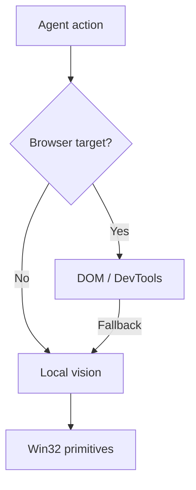

# computer-use

[](https://opensource.org/licenses/MIT)
[](https://www.python.org/downloads/)
[](https://github.com/Silverhorse7/computer-use)

`computer-use` is an experimental browser and desktop automation engine.

I built it while working with computer-use agents and getting annoyed by how often simple UI actions required another screenshot, another multimodal model call, and another few seconds of waiting.

The basic idea is simple: use the cheapest reliable interaction method first.

For browser tasks, that usually means the DOM. For simple visual recovery, use local image processing. For native desktop interaction, fall back to Windows primitives.

The model can still decide what to do, without needing a vision model for every click.

## How it works

There are currently three interaction paths:

1. **DOM / DevTools**  
   Direct browser interaction and extraction through DevTools.

   Typical interaction latency on my machine is under 20ms.

2. **Local vision**  
   In-memory image processing for cases where DOM access is not available or useful.

   I currently use this for things like field and validation-border detection.

3. **Win32**  
   Native Windows primitives for scrolling, keyboard input, mouse interaction, window management, and screen capture.

The layers can fall back to each other depending on the task.



## Why

A typical vision-driven computer-use loop looks roughly like this:

```text
take screenshot
    ↓
send screenshot to multimodal model
    ↓
wait for inference
    ↓
get coordinates/action
    ↓
perform action
    ↓
repeat
```

That is useful when visual reasoning is actually required.

It is less useful when the agent is filling seven normal form fields or clicking a button that is already available in the DOM.

I wanted the reasoning model to spend its time making decisions rather than repeatedly rediscovering the UI.

## Benchmarks

These are measurements from my own machine using Chrome on Windows 11 at 2560x1440.

| Method | Detection / perception | 7-field form |
| --- | ---: | ---: |
| Vision model loop | 6.5-8.5s per step | 65.8s |
| Local batched vision | ~158ms | 8.57s |
| DOM / DevTools | 6-19ms | ~0.45s |

The exact numbers obviously depend on the machine, page, model, network, and task.

The useful part for me is less the exact speedup and more that deterministic UI work no longer needs an LLM round trip.

More benchmark details are in [`examples/benchmarks/BENCHMARKS.md`](examples/benchmarks/BENCHMARKS.md).

## Installation

### Python

```bash
git clone https://github.com/Silverhorse7/computer-use.git
cd computer-use
pip install -e .
```

### PowerShell

The Windows module can also be imported directly:

```powershell
Import-Module .\powershell\ComputerUse.psd1
```

## Example

```python
from computer_use import ComputerUseController

cu = ComputerUseController()

cu.navigate("https://x.com/home")

posts = cu.extract_twitter_posts(
    count=20,
    auto_scroll=True,
)

summary = cu.summarize_feed(posts)
print(summary["markdown_digest"])

cu.interact_twitter_post(
    query="open-source",
    action="like",
)
```

This uses DOM extraction for the feed rather than repeatedly screenshotting and re-reading the page.

### DOM interaction

```python
cu.dom.select_radio("High Availability Multi-Region")
cu.dom.fill_input("Cluster Name", "production-us-east")
cu.dom.click_button("Deploy Changes")
```

### Local vision

```python
cu.batch.batch_fill_dropdowns(
    "form_screen.png",
    field_click_delay_ms=180,
)
```

### PowerShell

```powershell
Import-Module .\powershell\ComputerUse.psd1

Invoke-CUTwitterExtract -Count 20
Invoke-CUTwitterInteract -Query "open-source" -Action "like"

Invoke-CUCapture -Path "screen.png"
Invoke-CUClick -X 1280 -Y 850
```

## Implementation notes

### Browser interaction

The DOM driver dispatches browser events directly, including things like:

```text
mouseenter
mouseover
mousedown
mouseup
click
input
change
```

This is mainly to make interaction with React/Vue/Angular applications behave more like normal user input.

### Windows automation

The Windows backend uses Win32 APIs including `OpenInputDesktop`, `SetThreadDesktop`, cursor/input primitives, clipboard access, and window capture.

A fair amount of the work here came from dealing with Windows-specific behavior around desktop sessions, focus, DPI scaling, and background execution.

### Local vision

The vision layer is deliberately simple.

It currently uses pixel-level heuristics for things like input borders, dropdowns, text areas, and validation states.

For example, validation borders can be detected without sending the screen to a vision model.

This is not intended to replace general-purpose computer vision. It is mostly a fast fallback for UI structures that are easy to detect locally.

## Repository layout

```text
computer-use/
├── computer_use/
│   ├── core.py
│   ├── engine_dom.py
│   ├── engine_win32.py
│   ├── engine_vision.py
│   ├── engine_batch.py
│   ├── feed_summarizer.py
│   └── cli.py
├── powershell/
│   ├── ComputerUse.psd1
│   ├── ComputerUse.psm1
│   ├── CU_Engine.ps1
│   └── BatchEngine.ps1
├── skills/
│   └── computer-use/
├── examples/
├── tests/
└── pyproject.toml
```

## Agent integration

The repository also contains an agent skill under:

```text
skills/computer-use/
```

It documents when an agent should use DOM interaction, local vision, or native desktop automation.

I originally added this because I wanted coding agents to treat computer interaction as another tool rather than defaulting to screenshot-based reasoning for everything.

There are also small scripts for common flows such as feed extraction and form scanning.

## Status

This is still early and mostly built around problems I personally ran into.

Windows is currently the most developed desktop backend. Browser automation is more portable, while some of the native functionality is obviously Windows-specific.

There are likely plenty of weird applications and pages that it does not handle well yet.

Issues, ideas, and PRs are welcome.

## License

MIT
