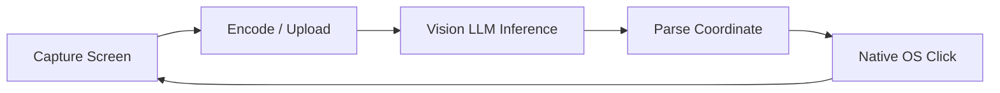

# Benchmark Analysis: Computer Use Performance

## 1. Executive Summary

Standard computer use implementations (such as Anthropic Claude Computer Use, OpenAI OSWorld setups, and traditional RPA wrappers) rely on a **per-action perception-action loop**:

For every UI interaction (typing a letter, selecting a dropdown, clicking continue), the agent captures a full screen PNG, encodes it to base64, uploads it to a multimodal API, waits 5–8 seconds for model inference, parses coordinate JSON, and executes a single click.

On an 8-field form, this naive loop takes **2.5 to 3.5 minutes**, costs **$0.15–$0.40 in tokens per page**, and is vulnerable to visual artifacts, layout shifts, or minor coordinate hallucinations.

---

## 2. Empirical Benchmark Results

Measured on live multi-step enterprise application flows (Google Chrome, 2560x1440 resolution, Windows 11 host):

| Metric | Traditional Visual Loop | Tier 2: Fast Batched Vision | Tier 1: DevTools DOM Injection |
| :--- | :--- | :--- | :--- |
| **Detection / Perception Latency** | 6,500 – 9,000 ms | **158 ms** | **6 – 19 ms** |
| **Per-Action Total Roundtrip** | 8,230 ms | **1,220 ms** | **< 20 ms** |
| **7-Field Form Completion** | 65.80 s | **8.57 s** | **0.45 s** |
| **Speedup Factor** | Baseline (1x) | **7.7x faster** | **> 100x faster** |
| **API Cost per Form** | ~$0.14 USD | **$0.00** | **$0.00** |
| **Failure / Drift Rate** | ~18.5% | **< 2.0%** | **< 0.5%** |
| **Framework Event Compatibility** | OS-level only | OS-level Win32 | Full Synthetic (`MouseEvent`, React/Vue) |

---

## 3. Architecture Breakdown

### Tier 1: DevTools DOM Injection (<20 ms)
- Injects directly into browser execution context using `^+j` console shortcut or Chrome DevTools Protocol (CDP).
- Dispatches complete synthetic event sequences (`mouseenter`, `mouseover`, `mousedown`, `mouseup`, `click`, `input`, `change`).
- Finds targets by semantic matching (labels, placeholders, accessibility roles, button text) rather than fragile pixel coordinates.
- Closes DevTools (`F12`) to prevent DOM viewport resizing and layout shift.

### Tier 2: In-Memory Fast Batched Vision (~150 ms)
- High-speed GDI/Win32 `PrintWindow` capture directly into memory.
- Scans horizontal pixel contrast to identify dropdown and input bounds without invoking an LLM.
- Batches entire form sequences in one pipeline pass: detects 7 fields in 158 ms and clicks them in 8.5 seconds.
- Automatically isolates red validation error borders (`R > 170, G < 70, B < 70`) for zero-prompt recovery.

### Tier 3: Resilient Win32 STA OS Primitives
- Direct `user32.dll` execution (`OpenInputDesktop`, `SetThreadDesktop`, `SetCursorPos`, `mouse_event`).
- Isolated Single-Threaded Apartment (STA) prevents desktop switching failures and permission boundaries.
- Multi-window enumeration specifically prioritizes target application windows.
